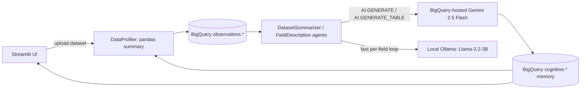

# Gaby BigQuery Gatekeeper

[](#)
[](https://python.org)
[](https://cloud.google.com/bigquery)

My Kaggle "BigQuery AI Hackathon" submission for **Gaby**, a promptless, self-directed data-cleaning agent: instead of calling an LLM API and a database as two separate systems, it pushes reasoning itself into SQL via BigQuery's `AI.GENERATE`/`AI.GENERATE_TABLE`, and uses BigQuery tables as the agent's episodic memory.

## Highlights

- **Objective**: test whether a data warehouse can double as an agent's reasoning engine and long-term memory, so Gaby's field-level decisions (descriptions, missing-data strategy) are generated and stored in the same place the data lives, instead of round-tripping through a separate app-side LLM call.
- **Key Feature**:
  - **BigQuery-as-reasoning-engine** — SQL templates in `bigquery_tools.py` parameterize `AI.GENERATE`/`AI.GENERATE_TABLE` calls against a BigQuery-hosted Gemini 2.5 Flash model connection, so field descriptions and missing-data strategies are generated inside the query itself.
  - **Memory Gatekeeper** — a `pandas_gatekeeper` decorator guards query execution and treats `observations.*`/`cognitive.*` BigQuery tables as the agent's episodic memory, persisting what it has already learned about a dataset across episodes.
  - **Dual-LLM split** — a local Ollama model (Llama-3.2-3B-Instruct) handles fast, per-field reasoning loops; the remote BigQuery-hosted Gemini endpoint handles scaled, batch generation.
  - A declarative agent-subclassing pattern (`GabyBasement`) and a docstring-introspecting `Toolbox` function-calling registry for exposing Python tools to the LLM.
- **Tech stack**: `google-cloud-bigquery` / `google-cloud-aiplatform` (Gemini 2.5 Flash as a BigQuery remote model), local Ollama client, Streamlit demo UI, pandas/numpy/seaborn/matplotlib/altair/plotly/statsmodels/scipy for profiling, `sentence-transformers`/`transformers` for semantic field matching, Docker Compose (webapp + Ollama + a resource-capped agent sandbox container), pydantic `BaseSettings` config, pytest.
- **Evaluation**: the main Kaggle submission notebook runs the full pipeline end-to-end against a real "dirty" Café Sales dataset as a demo/validation pass; `missing_data_tests.ipynb` implements t-test/chi-square-based classification of missingness type (MAR vs. MCAR) against synthetic mock data as the closest thing to a formal benchmark; `test_core_agent__core.py` unit-tests the `GabyBasement.__init_subclass__` agent-registration behavior.
- **Results & Conclusion**:
  - Embedding `AI.GENERATE` calls directly in SQL removes an entire integration layer (no separate LLM client in the hot path) and keeps generated metadata co-located with the data it describes.
  - The repo was captured mid-refactor (a `v1 → v2` migration): several imports in `src/v2` reference a `config` package and a `v1.core.config` module that no longer exist in the tree, and the sole test file imports from a `src.gaby_agent...` path that doesn't match `src/v2` — a reminder to finish the migration before extending this further.
  - Next: resolve the broken import graph, then decide whether BigQuery AI stays Gaby's primary memory store or becomes one of several backends behind a common memory interface.

## Project Directory Overview

```text
databy-bq/
├── notebooks/
│   ├── gcp_first_run.ipynb, gcp_upload_file.ipynb, gcp_add_boolean_column.ipynb
│   ├── kaggle_data_cleaning_demo_submission.ipynb   # main Kaggle demo
│   └── missing_data_tests.ipynb                     # MAR/MCAR statistical tests
├── src/
│   └── v2/
│       ├── agent/    # _core.py (GabyBasement), registry.py (Toolbox), swamp.py (agents)
│       ├── db/       # crud.py (BigQuery upload), schema.py (dataclasses)
│       ├── tools/    # bigquery_tools.py (AI.GENERATE SQL templates), sandbox.py
│       └── utils/    # setup.py (Settings/LocalConfig/EpisodeConfig)
├── tests/
│   └── test_core_agent__core.py
├── docker-compose.yml
├── pyproject.toml
├── requirements.txt
└── feedback.txt
```

## System Architecture



The RL-flavoured framing in the original README treats this as a loop — Agent → BigQuery SQL/AI/ML → Dataset/Environment → reward trajectory → back to the Agent — with the Memory Gatekeeper deciding what gets written back into `cognitive.*` for future episodes to read.

## Dev Notes

- **Requirements**
  - Python ≥ 3.9
  - A Google Cloud project with BigQuery + BigQuery AI (Gemini remote model connection) enabled
  - Ollama running locally (or a hosted Ollama endpoint) for the local LLM path

- **Installation**:

    ```bash
    # Clone the repository
    git clone https://github.com/whoamimi/databy-bq.git
    cd databy-bq

    # Create and activate environment
    conda create -n databy-gatekeeper python=3.9 -y
    conda activate databy-gatekeeper

    # Install dependencies
    pip install -r requirements.txt
    cp .env.example .env   # fill in GCP + Ollama credentials
    ```

- **To start**:

    ```bash
    docker compose up
    # or, for the Streamlit demo alone
    streamlit run src/v2/app.py
    ```

- **Test**:

    ```bash
    pytest
    ```

- **Reproducing Results**: to rerun the Kaggle submission demo:
  1. Set your BigQuery project/dataset IDs in `.env`.
  2. Open and run `notebooks/kaggle_data_cleaning_demo_submission.ipynb` top to bottom against the Café Sales dataset (or your own dataset uploaded via `src/v2/db/crud.py`).

## Citation

If you use this software or method in your work, please cite it as follows:

```bibtex
@software{mimi2026databygatekeeper,
  author = {Mimi},
  title  = {databy-gatekeeper: BigQuery AI as reasoning engine and memory for the Gaby data-cleaning agent},
  year   = {2026},
  url    = {https://github.com/whoamimi/databy-bq}
}
```
